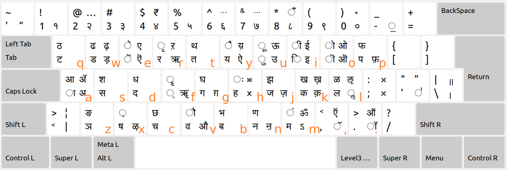
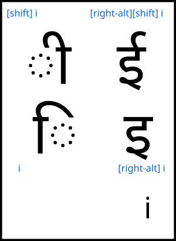

# sanskrit-kagapa-windows
Sanskrit KaGaPa phonetic keyboard for windows. Devanagari script, KaGaPa phonetic as used by Ubuntu native.

### How to install
- Add Sanskrit language in Windows' Languages, if not already added
- Download the 'sakagapa' folder and run the setup file.
- Restart windows and you will see the SaKaGaPa keyboard under the Sanskrit language keyboard section in Windows settings

### Usage Examples
- कपोतः - k, p, [shift] o, t, [shift]h
- एवम् - [right-alt][shift] e, v, m, f
- कालिदासः - k, a, l, i, d, a, s, [shift]h
- परमेश्वरः - p, r, m, [shift]e, [shift]s, f, v, r, [shift]h
- कक्षा - k, k, f, x, a

### How to alter the layout
- Install [Microsoft Keyboard Layout Creator](https://www.microsoft.com/en-us/download/details.aspx?id=102134)
- Open the file 'sanskrit_kagapa_microsoft_keyboard_layout_creator_source' in Keyboard Layout Creator
- Make your changes to the layout and run Project -> Build setup package. Install by running the setup
- Restart. Note that your altered keyboard name should not conflict with existing keyboards.
